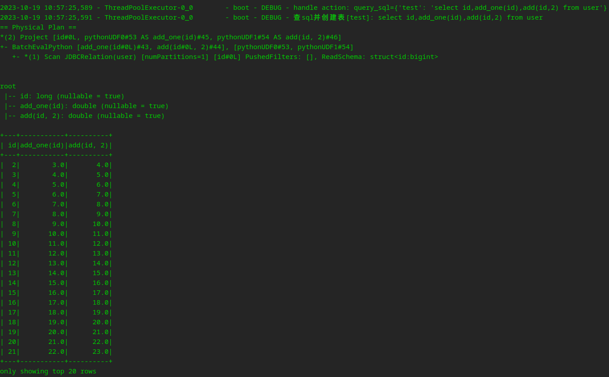

[GitHub](https://github.com/shigebeyond/SparkBoot) | [Gitee](https://gitee.com/shigebeyond/SparkBoot)

# SparkBoot - yaml驱动Spark开发

考虑到部分测试伙伴python能力不足，因此扩展Appium，支持通过yaml配置测试步骤;

## 一、概述
Spark太复杂了，特别是涉及到scala与python开发，学习与使用成本很高，因此创作了SparkBoot工具，开发人员仅编写yaml与sql即可实现复杂的Spark编程，为其屏蔽了底层开开发细节，减轻了开发难度，让其更专注于大数据分析的逻辑；

框架通过编写简单的yaml, 就可以执行一系列复杂的spark操作步骤, 如读数据/写数据/sql查询/打印变量等，极大的简化了伙伴Spark编程的工作量与工作难度，大幅提高人效；

框架通过提供类似python`for`/`if`/`break`语义的步骤动作，赋予伙伴极大的开发能力与灵活性，能适用于广泛的应用场景。

框架提供`include`机制，用来加载并执行其他的步骤yaml，一方面是功能解耦，方便分工，一方面是功能复用，提高效率与质量，从而推进脚本整体的工程化。

## 二、特性
1. 底层基于 pyspark 库来实现 
2. 支持通过yaml来配置执行的步骤，简化了生成代码的开发:
每个步骤可以有多个动作，但单个步骤中动作名不能相同（yaml语法要求）;
动作代表spark上的一种操作，如read_csv/query_sql等等;
3. 支持类似python`for`/`if`/`break`语义的步骤动作，灵活适应各种场景
4. 支持`include`引用其他的yaml配置文件，以便解耦与复用

## 三、同类yaml驱动框架
[HttpBoot](https://github.com/shigebeyond/HttpBoot)
[SeleniumBoot](https://github.com/shigebeyond/SeleniumBoot)
[AppiumBoot](https://github.com/shigebeyond/AppiumBoot)
[MiniumBoot](https://github.com/shigebeyond/MiniumBoot)
[MonitorBoot](https://github.com/shigebeyond/MonitorBoot)
[K8sBoot](https://github.com/shigebeyond/K8sBoot)

## 四、todo
1. 支持更多的动作

## 五、安装
```
pip3 install SparkBoot
```

安装后会生成命令`SparkBoot`;

注： 对于深度deepin-linux系统，生成的命令放在目录`~/.local/bin`，建议将该目录添加到环境变量`PATH`中，如
```
export PATH="$PATH:/home/shi/.local/bin"
```

## 六、使用
### 1 本地执行
```
# 以local模式来执行 步骤配置文件中定义的spark作业
SparkBoot 步骤配置文件.yml

# 生成spark作业的相关文件，用于cluster/yarn模式中给spark-submit提交作业
# 生成文件包含: 1 submit.sh spark-submit的提交作业的命令 2 run.py python入口文件 3 步骤配置文件
# 提交作业命令如: spark-submit --master spark://192.168.62.209:7077 run.py 步骤配置文件
SparkBoot 步骤配置文件.yml  -o 作业文件的生成目录
```

如执行 `SparkBoot example/test.yml`，输出如下
```
2023-09-25 12:34:22,578 - ThreadPoolExecutor-0_0	- boot - DEBUG - handle action: set_vars={'outdir': '../data'}
2023-09-25 12:34:22,578 - ThreadPoolExecutor-0_0	- boot - DEBUG - handle action: else=[{'init_session': {'app': 'test'}, 'set_vars': {'outdir': '/output'}}]
2023-09-25 12:34:22,578 - ThreadPoolExecutor-0_0	- boot - DEBUG - handle action: read_jdbc={'user': {'url': 'jdbc:mysql://192.168.62.209:3306/test', 'table': 'user', 'properties': {'user': 'root', 'password': 'root', 'driver': 'com.mysql.jdbc.Driver'}}}
+---+--------+--------+------+---+------+
| id|username|password|  name|age|avatar|
+---+--------+--------+------+---+------+
|  1|        |        | shi-1|  1|  null|
|  2|        |        | shi-2|  2|  null|
|  3|        |        | shi-3|  3|  null|
+---+--------+--------+------+---+------+
only showing top 20 rows

2023-09-25 12:34:27,231 - ThreadPoolExecutor-0_0	- boot - DEBUG - handle action: write_csv={'user': {'path': '$outdir/user.csv', 'mode': 'overwrite'}}
2023-09-25 12:34:27,783 - ThreadPoolExecutor-0_0	- boot - DEBUG - handle action: read_csv={'user2': {'path': '$outdir/user.csv'}}
......
```
命令会自动执行`test.yaml`文件中定义的spark任务

### 2 集群中执行
1. 先生成作业文件
```sh
SparkBoot udf-test.yml -u udf-test.py -o out
```

## 七、步骤配置文件及demo
用于指定多个步骤, 示例见源码 [example](example) 目录下的文件;

顶级的元素是步骤;

每个步骤里有多个动作(如read_csv/query_sql)，如果动作有重名，就另外新开一个步骤写动作，这是由yaml语法限制导致的，但不影响步骤执行。

简单贴出3个demo
1. 基本api测试: 详见 [example/test.yml](example/test.yml)
1. 简单的单词统计: 详见 [example/word-count.yml](example/word-count.yml)
2. 复杂的订单统计: 详见 [example/order-stat.yml](example/order-stat.yml)

## 八、配置详解
支持通过yaml来配置执行的步骤;

每个步骤可以有多个动作，但单个步骤中动作名不能相同（yaml语法要求）;

动作代表spark上的一种操作，如read_csv/query_sql等等;

下面详细介绍每个动作:

### 1 初始化session的动作
1. init_session: 初始化spark session
```yaml
- init_session:
    app: test
    master: local[*] # master: 对local仅在本地调试时使用，如果是在集群中运行，则需要删掉本行，并在spark-submit命令中指定master
    log_level: error # 日志级别
```

### 2 读批数据的动作
2. read_csv: 读csv数据
```yaml
read_csv:
  # key是表名, value是csv文件路径
  user: /data/input/user.csv
```

3. read_json: 读json数据
```yaml
read_json:
  # key是表名, value是json文件路径
  user: /data/input/user.json
```

4. read_orc: 读orc数据
```yaml
read_orc:
  # key是表名, value是orc文件路径
  user: /data/input/user.orc
```

5. read_parquet: 读parquet数据
```yaml
read_parquet:
  # key是表名, value是parquet文件路径
  user: /data/input/user.parquet
```

6. read_text: 读文本数据
```yaml
read_text:
  # key是表名, value是文本文件路径
  lines: /data/input/words.txt
```

7. read_jdbc: 读jdbc数据
```yaml
read_jdbc:
    # key是表名, value是jdbc连接配置
    user:
      url: jdbc:mysql://192.168.62.209:3306/test
      table: user
      properties:
        user: root
        password: root
        driver: com.mysql.jdbc.Driver # 需要提前复制好mysql驱动jar，参考pyspark.md
```

8. read_table: 读表数据
```yaml
# 接收字典参数
read_table:
    # key是新表名, value是旧表名
    user2: user
# 接收数组参数
read_table:
  - user
```

### 3 读流数据的动作
9. reads_rate: 读模拟流数据
```yaml
reads_rate:
    # key是表名, value是参数
    user:
      rowsPerSecond: 10 # 每秒产生10行
```

10. reads_socket: 读socket流数据
```yaml
reads_socket:
    # key是表名, value是socket server的ip端口
    user: localhost:9999
```

11. reads_kafka: 读kafka流数据
```yaml
reads_kafka:
    # key是表名, value是kafka brokers+topic
    user:
      brokers: localhost:9092 # 多个用逗号分割
      topic: test
```

12. reads_csv: 读csv流数据
```yaml
reads_csv:
  # key是表名, value是csv文件路径
  user: /data/input/user.csv
```

13. reads_json: 读json流数据
```yaml
reads_json:
  # key是表名, value是json文件路径
  user: /data/input/user.json
```

14. reads_orc: 读orc流数据
```yaml
reads_orc:
  # key是表名, value是orc文件路径
  user: /data/input/user.orc
```

15. reads_parquet: 读parquet流数据
```yaml
reads_parquet:
  # key是表名, value是parquet文件路径
  user: /data/input/user.parquet
```

16. reads_text: 读文本流数据
```yaml
reads_text:
  # key是表名, value是文本文件路径
  lines: /data/input/words.txt
```

### 4 执行sql的动作
17. query_sql: 执行sql
```yaml
- query_sql:
    # key是表名, value是查询sql
    words: select explode(split(value," ")) as word from lines
    word_count: select word, count(1) as cnt from words group by word
```

### 5 写批数据的动作
18. write_csv: 写csv数据
```yaml
write_csv:
    # key是表名, value是csv文件路径
    user: /data/output/user.csv
# 或
write_csv:
    user:
      path: /data/output/user.csv
      mode: overwrite # 模式：append/overwrite/ignore
      #compression: none # 不压缩
```

19. write_json: 写json数据
```yaml
write_json:
    # key是表名, value是json文件路径
    user: /data/output/user.json
```

20. write_orc: 写orc数据
```yaml
write_orc:
    # key是表名, value是orc文件路径
    user: /data/output/user.orc
```

21. write_parquet: 写parquet数据
```yaml
write_parquet:
    # key是表名, value是parquet文件路径
    user: /data/output/user.parquet
```

22. write_text: 写文本数据
```yaml
write_text:
    # key是表名, value是文本文件路径
    user: /data/output/user.txt
```

23. write_jdbc: 写jdbc数据
```yaml
write_jdbc:
    # key是表名, value是jdbc连接配置
    user:
      url: jdbc:mysql://192.168.62.209:3306/test
      table: user
      properties:
        user: root
        password: root
        driver: com.mysql.jdbc.Driver # 需要提前复制好mysql驱动jar，参考pyspark.md
```

### 6 写流数据的动作
24. writes_console: 将流数据写到控制台
```yaml
writes_console:
  # key是表名, value是参数
  user:
    checkpointLocation: path/to/checkpoint/dir
    outputMode: complete # append/update/complete
```
25. writes_kafka: 写kafka流数据
```yaml
writes_kafka:
  # key是表名, value是kafka brokers+topic
  user:
    brokers: localhost:9092 # 多个用逗号分割
    topic: test
    checkpointLocation: path/to/checkpoint/dir
    outputMode: complete # append/update/complete
```

26. writes_csv: 写csv数据
```yaml
writes_csv:
    # key是表名, value是文本文件路径
    user:
      path: /data/output/user.csv
      mode: overwrite # 模式：append/overwrite/ignore
      #compression: none # 不压缩
      checkpointLocation: path/to/checkpoint/dir
      outputMode: complete # append/update/complete
```

27. writes_json: 写json数据
```yaml
writes_json:
    # key是表名, value是json文件路径
    user: 
      path: /data/output/user.json
      checkpointLocation: path/to/checkpoint/dir
      outputMode: complete # append/update/complete
```

28. writes_orc: 写orc数据
```yaml
writes_orc:
    # key是表名, value是orc文件路径
    user: 
      path: /data/output/user.orc
      checkpointLocation: path/to/checkpoint/dir
      outputMode: complete # append/update/complete
```

29. writes_parquet: 写parquet数据
```yaml
writes_parquet:
    # key是表名, value是parquet文件路径
    user: 
      path: /data/output/user.parquet
      checkpointLocation: path/to/checkpoint/dir
      outputMode: complete # append/update/complete
```

30. writes_text: 写文本数据
```yaml
writes_text:
  # key是表名, value是文本文件路径
    user: 
      path: /data/output/user.txt
      checkpointLocation: path/to/checkpoint/dir
      outputMode: complete # append/update/complete
```

### 7 其他动作
31. print: 打印, 支持输出变量/函数;
```yaml
# 调试打印
print: "总申请数=${dyn_data.total_apply}, 剩余份数=${dyn_data.quantity_remain}"
```

32. for: 循环;
    for动作下包含一系列子步骤，表示循环执行这系列子步骤；变量`for_i`记录是第几次迭代（从1开始）,变量`for_v`记录是每次迭代的元素值（仅当是list类型的变量迭代时有效）
```yaml
# 循环3次
for(3) :
  # 每次迭代要执行的子步骤
  - switch_sheet: test

# 循环list类型的变量urls
for(urls) :
  # 每次迭代要执行的子步骤
  - switch_sheet: test

# 无限循环，直到遇到跳出动作
# 有变量for_i记录是第几次迭代（从1开始）
for:
  # 每次迭代要执行的子步骤
  - break_if: for_i>2 # 满足条件则跳出循环
    switch_sheet: test
```

33. once: 只执行一次，等价于 `for(1)`;
    once 结合 moveon_if，可以模拟 python 的 `if` 语法效果
```yaml
once:
  # 每次迭代要执行的子步骤
  - moveon_if: for_i<=2 # 满足条件则往下走，否则跳出循环
    switch_sheet: test
```

34. break_if: 满足条件则跳出循环;
    只能定义在for/once循环的子步骤中
```yaml
break_if: for_i>2 # 条件表达式，python语法
```

35. moveon_if: 满足条件则往下走，否则跳出循环;
    只能定义在for/once循环的子步骤中
```yaml
moveon_if: for_i<=2 # 条件表达式，python语法
```

36. if/else: 满足条件则执行if分支，否则执行else分支
```yaml
- set_vars:
    txt: '进入首页'
- if(txt=='进入首页'): # 括号中包含的是布尔表达式，如果表达式结果为true，则执行if动作下的子步骤，否则执行else动作下的子步骤
    - print: '----- 执行if -----'
  else:
    - print: '----- 执行else -----'
```

37. include: 包含其他步骤文件，如记录公共的步骤，或记录配置数据(如用户名密码);
```yaml
include: part-common.yml
```

38. set_vars: 设置变量;
```yaml
set_vars:
  name: shi
  password: 123456
  birthday: 5-27
```

39. print_vars: 打印所有变量;
```yaml
print_vars:
```

## 九、UDF 用户定义函数
1. 定义 UDF: [udf-test.py](example/udf-test.py)
```python
from pyspark.sql.functions import udf
from pyspark.sql.types import *

@udf(returnType=DoubleType())
def add(m, n):
    return float(m) + float(n)

@udf(returnType=DoubleType())
def add_one(a):
    return float(a) + 1.0
```

2. 定义步骤文件: [udf-test.yml](example/udf-test.yml)
```yaml
- debug: true # 遇到df就show()
# 1 初始化spark session
- init_session:
    app: test
    master: local[*]
    log_level: error # 日志级别
# 2 读mysql
- read_jdbc:
    user:
      url: jdbc:mysql://192.168.62.209:3306/test
      table: user
      properties:
        user: root
        password: root
        driver: com.mysql.jdbc.Driver # 需要提前复制好mysql驱动jar，参考pyspark.md
# 3 查sql: select udf
- query_sql:
    test: select id,add_one(id),add(id,2) from user
```

3. 命令行执行，需用`-u`来指定UDF所在的python文件
```sh
SparkBoot udf-test.yml -u udf-test.py
```
执行结果如下
